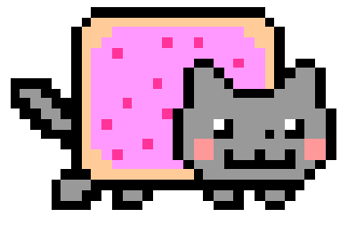
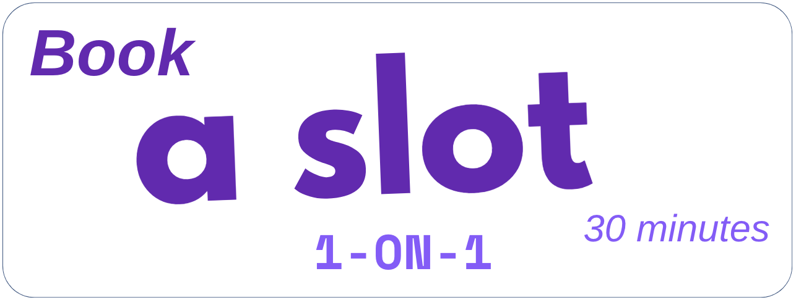
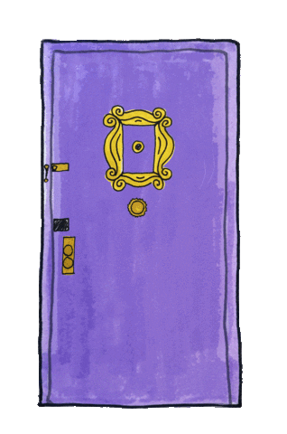
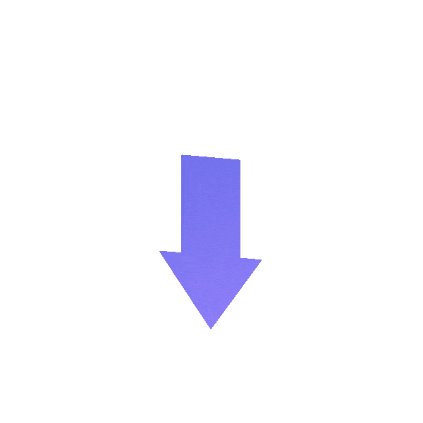

#  Hi there, Tamy Here – Welcome to My Code Space 

[](mailto:tamy.le.cs@gmail.com "Connect via Email")
[](https://www.linkedin.com/in/tamy-le/ "Connect on LinkedIn")
[](https://leetcode.com/tamy-le/ "My Leet Code")


##  A little about me 


####  Tamy Le | 💻 Full Stack Developer | 📍Tokyo, Japan 🇯🇵 | 🇻🇳 Vietnamese </h3>

With over four years in the tech industry, I am a versatile Full-Stack Developer with a solid foundation in Computer Science. Deeply passionate about AI and Pythonic programming 🐍. I am committed to crafting efficient and innovative tech solutions. Eager to collaborate on impactful projects, I am always open to feedback and thrive on continuous learning. Living life to the fullest and embracing every learning opportunity with enthusiasm! 🔥

---

## </a> Have a virtual sip?

 I thrive on collaboration. If you're interested in my work, have feedback, or just want to chat, I’d love to hear from you. Please book a slot, and let’s explore how we can inspire each other! </a>

👇🏻 Down here

<a href="https://calendly.com/tamy-le-cs/30min"></a>

☝🏻 Just above

---

##  A little more

```javascript
const tamy = {
    pronouns: ["She", "Her"],
    code: ["Javascript", "Python", "C++"],
    askMeAbout: ["web dev", "tech", "app dev", "deep learning"],
    technologies: {
        backEnd: {
            python: ["Flask", "Django", "FastAPI"],
        },
        frontEnd: {
            basics: ["HTML", "Javascript", "CSS"],
            frameworks: ["ReactJs", "NextJs"],
            styling: ["TailwindCSS"]
        },
        devOps: ["AWS", "Docker🐳", "Nginx"],
        databases: ["DynamoDB", "MySQL", "PostgreSQL"],
        misc: ["Firebase", "Selenium"]
    },
    architecture: ["Serverless Architecture", "Progressive Web Applications", "Single Page Applications"],
    currentFocus: "Mastering Full Stack Development to create apps that simplify everyday tasks",
    funFact: "Did you know? Happiness multiplies in the company of good relationships! 🌼"
};
```

---

## Favorite Tech

> Tools, languages, and other things that I like to work with.

&nbsp;&nbsp;
&nbsp;&nbsp;
&nbsp;&nbsp;
&nbsp;&nbsp;
&nbsp;&nbsp;
&nbsp;&nbsp;
&nbsp;&nbsp;
&nbsp;&nbsp;
&nbsp;&nbsp;
&nbsp;&nbsp;
&nbsp;&nbsp;
&nbsp;&nbsp;
&nbsp;&nbsp;
&nbsp;&nbsp;
&nbsp;&nbsp;
&nbsp;&nbsp;
![gRPC](https://img.shields.io/badge/gRPC-black?logo=data:image/svg+xml;base64,PHN2ZyB4bWxucz0iaHR0cDovL3d3dy53My5vcmcvMjAwMC9zdmciIHdpZHRoPSI2NCIgaGVpZ2h0PSI2NCI+PHBhdGggZD0iTTI3LjEyNSAzNi4xNnYxMi40NmMwIDIuNTkzLjQ0IDQuODQ3IDEuMzIzIDYuNzYyczIuMDQ0IDMuNTA2IDMuNDg1IDQuNzczIDMuMDYgMi4yMjUgNC44NTMgMi44NzNTNDAuMzkgNjQgNDIuMjEyIDY0czMuNjMyLS4zMjQgNS40MjYtLjk3MiAzLjQxMi0xLjYwNiA0Ljg1My0yLjg3MyAyLjYwMy0yLjg1OCAzLjQ4NS00Ljc3MyAxLjMyMy00LjE3IDEuMzIzLTYuNzYyVjI3Ljg2bC0xNi4xMjYtLjAyNS0uMDIgOC4zMjVINDguM3YxMi40NmMwIDIuMTgtLjYwMyAzLjc4Ni0xLjggNC44MThzLTIuNjMyIDEuNTQ3LTQuMjggMS41NDctMy4wNzMtLjUxNi00LjI4LTEuNTQ3LTEuOC0yLjYzNy0xLjgtNC44MThWMTUuMzhjMC0yLjE4LjYwMy0zLjc4NiAxLjgtNC44MThzMi42MzItMS41NDcgNC4yOC0xLjU0NyAzLjA3My41MTYgNC4yOCAxLjU0NyAxLjggMi42MzggMS44IDQuODE4djMuMTgyaDlWMTUuMzhjMC0yLjUzNC0uNDQtNC43NzMtMS4zMjMtNi43MThzLTIuMDQ0LTMuNTUtMy40ODUtNC44MThTNDkuNDMyIDEuNjIgNDcuNjQuOTcgNDQuMDM1IDAgNDIuMjEyIDBzLTMuNjMyLjMyNC01LjQyNi45NzItMy40MTIgMS42MDYtNC44NTMgMi44NzMtMi42MDMgMi44NzMtMy40ODUgNC44MTgtMS4zMjMgNC4xODQtMS4zMjMgNi43MTh2MTIuNDZoLTkuMjA3di05LjI4aDIuODI0bC03LjAyLTkuOTItNy4wMiA5LjkyaDIuOTJWMzJjMCAyLjI5OCAxLjg1NyA0LjE2IDQuMTUgNC4xNmgxMy4zNTV6IiBmaWxsPSIjMmRhNmIwIiBmaWxsLXJ1bGU9ImV2ZW5vZGQiLz48L3N2Zz4=&style=social)&nbsp;&nbsp;
&nbsp;&nbsp;
&nbsp;&nbsp;
&nbsp;&nbsp;
&nbsp;&nbsp;

---

##  Github Coding Activity Stats

NOTE: This does not indicate my skill level or language proficiency, it's merely a GitHub metric of which languages I have the most code of on GitHub.

|  |  |  |
| ---------------------------------------------------------------------------------------------------------------------------------------------------------------------------------------- | ------------------------------------------------------------------------------------------------------------------------------------ | ----------------------------------------------------------------------------------------------------------------------------------------------- |

[]

---



<em>I love making new friends and learning from everyone! Whether you're a tech enthusiast, a fellow developer, or just someone with interesting ideas, I'm always open to connecting and exchanging knowledge. Feel free to reach out to me anytime!</em>

<div align=center>
    <em><b>Let's connect and learn from each other!</b></em>😊

[](mailto:tamy.le.cs@gmail.com)
[](https://www.linkedin.com/in/tamy-le)

</div>

---





<div align=center>
 <h1>Check Out What I Do In My Free Time</h1>
</div>
